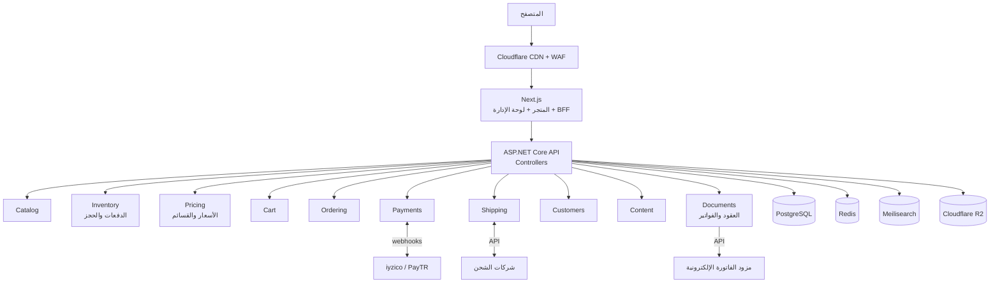

# البنية المعمارية (Architecture)

## 1. الشكل: Modular Monolith بمستأجر واحد

متجر واحد (ليس منصة متعددة المستأجرين)، لذا البنية أبسط من مشروع ورّاق: لا عزل مستأجرين، لكن **دقة أعلى في المال والمخزون**. تطبيق خلفي واحد بوحدات معزولة، كل وحدة بمخطط PostgreSQL خاص، تتواصل عبر Contracts وأحداث Outbox. (ADR-001)



## 2. الوحدات

| الوحدة | مسؤوليتها |
|---|---|
| Catalog | المنتجات، الخيارات، الخصائص حسب النوع، التحذيرات، الوسائط، القواميس (النوتات، أنواع العسل) |
| Inventory | الدفعات، الكميات، الحجز والتحرير، FEFO، تنبيهات النقص والانتهاء |
| Pricing | الأسعار وتاريخها، القسائم، حساب الخصم وأدنى سعر 30 يومًا، الضريبة |
| Cart | السلة (ضيف أو زبون)، الدمج عند تسجيل الدخول، صناديق الهدايا |
| Ordering | إنشاء الطلب (اللقطة المجمدة)، آلة الحالات، الإرجاع |
| Payments | الجلسات مع المزود، webhooks، الاسترداد، المطابقة اليومية |
| Shipping | المناطق والأسعار، إنشاء الشحنات، التتبع |
| Customers | الحسابات، العناوين، الموافقات |
| Content | الصفحات، القصص، دليل العطور (الأسئلة والقواعد)، البانرات |
| Documents | توليد العقود وPDF، الفاتورة الإلكترونية |
| Notifications | البريد، SMS، واتساب (معاملاتي) |

## 3. المستودع

```
rahiq/
├── backend/
│   ├── src/
│   │   ├── Rahiq.Api/                     # Program.cs، Middleware، تجميع الوحدات
│   │   ├── BuildingBlocks/
│   │   │   ├── Rahiq.SharedKernel/        # Entity, AggregateRoot, Result, Error, Money, DomainEvent
│   │   │   ├── Rahiq.Application.Abstractions/
│   │   │   └── Rahiq.Infrastructure.Common/  # Outbox, Idempotency, EF conventions
│   │   └── Modules/{Catalog,Inventory,Pricing,Cart,Ordering,Payments,Shipping,Customers,Content,Documents,Notifications}/
│   │       ├── *.Domain / *.Application / *.Infrastructure / *.Presentation / *.Contracts
│   ├── tests/
│   │   ├── Rahiq.ArchitectureTests/
│   │   ├── Rahiq.*.Domain.Tests/
│   │   ├── Rahiq.IntegrationTests/        # Testcontainers
│   │   └── Rahiq.CommerceTests/           # المال، الحجز، التزامن، webhooks (إلزامية)
│   └── Directory.Packages.props
├── frontend/
│   ├── apps/web/                          # المتجر + /admin
│   └── packages/{ui, three, i18n, api-client}
├── infra/{docker, compose, scripts}
└── docs/{adr, prd.md, brand-package/}
```

## 4. Clean Architecture و CQRS

نفس نمط ورّاق: Domain غني، Application بـ Commands و Queries، Infrastructure للتنفيذ، Presentation بـ Controllers رقيقة (ADR-003). اختبارات البنية (NetArchTest) تمنع كسر الحدود.

خط المعالجة بالترتيب: Logging ← Validation ← Authorization ← **Idempotency** (للـ Commands الحساسة: الدفع، إنشاء الطلب، الاسترداد) ← Caching (للـ Queries) ← UnitOfWork + Outbox.

## 5. أنماط خاصة بالتجارة

- **مفتاح عدم التكرار (Idempotency Key):** كل Command مالي يحمل مفتاحًا فريدًا من العميل (`Idempotency-Key` header). جدول يحفظ المفتاح والنتيجة. إعادة الطلب نفسه (نقر مزدوج، إعادة إرسال الشبكة) تعيد النتيجة المحفوظة ولا تنفذ مرتين.
- **Saga خفيفة للدفع:** إنشاء الطلب ← حجز المخزون ← جلسة الدفع ← (webhook نجاح) تثبيت الحجز وتأكيد الطلب ← الفاتورة ← الإشعار. أي فشل له خطوة تعويض محددة (تحرير الحجز، إلغاء الطلب). منفذة كآلة حالات على الطلب، لا بمكتبة Saga ثقيلة.
- **التزامن على المخزون:** تحديث ذري في قاعدة البيانات، لا "اقرأ ثم احسب ثم اكتب" في الذاكرة (التفاصيل في commerce-flows.md).
- **المطابقة (Reconciliation):** مهمة يومية تقارن مدفوعات المزود بالطلبات. أي فرق = تنبيه.

## 6. الكاش

- صفحات المنتجات والأقسام: ISR في Next.js + Output Caching في الـ API، مع إبطال بالوسوم عند `ProductPublished` و `PriceChanged`.
- **المخزون والسعر في لحظة الإضافة للسلة والدفع يُقرآن من قاعدة البيانات دائمًا**، لا من الكاش. صفحة المنتج تعرض "متوفر" من الكاش، لكن القرار الفعلي في الخادم.
- HybridCache (ذاكرة + Redis) للقواميس والقوائم.

## 7. التوسع
API بلا حالة خلف موازن، Data Protection مشتركة، الصور من CDN مباشرة، والبحث منفصل. متجر بهذا الحجم يعمل بارتياح على خادمين متوسطين لسنوات. لا Microservices.
