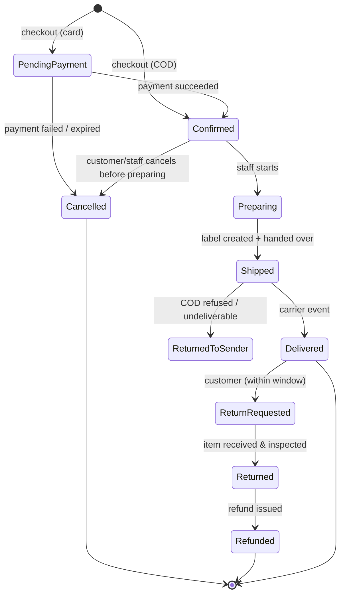
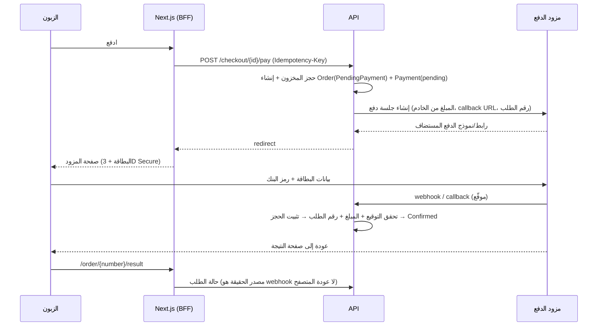

# تدفقات التجارة (Commerce Flows)

هذا أخطر ملف في المشروع. كل تدفق هنا يلمس مال الزبون أو مخزون المتجر. اختباراته تُكتب قبل كوده.

## 1. السلة

- سلة الضيف: معرّف في كوكي httpOnly، مخزنة في قاعدة البيانات (لا في localStorage)، عمرها 30 يومًا.
- عند تسجيل الدخول: دمج سلة الضيف مع سلة الحساب (جمع الكميات ضمن الحدود).
- **السلة لا تحجز مخزونًا.** تعرض التوفر الحالي فقط. الحجز يبدأ عند الدفع.
- كل عرض للسلة يعيد حساب الأسعار من الخادم. إن تغير سعر منذ الإضافة، يظهر تنبيه واضح.
- حدود: العيّنات 3 لكل طلب، الكمية القصوى 10 لكل خيار (قابلة للضبط، تمنع استنزاف المخزون).
- صندوق الهدايا في السلة سطر واحد له "مكونات" مخفية تُحجز عند الدفع.

## 2. خطوات الدفع

ثلاث خطوات على صفحة واحدة، هادئة وسريعة (القانون 10):

1. **التواصل والعنوان:** البريد والهاتف، العنوان (المحافظة ثم الحي من قوائم، لتقليل أخطاء العناوين)، خيار "هدية لشخص آخر" مع رسالة وإخفاء الأسعار من الفاتورة المرفقة.
2. **الشحن:** الخيارات والأسعار المحسوبة (أدناه).
3. **الدفع:** بطاقة (مع جدول التقسيط الفعلي من المزود) أو عند الاستلام، ثم مربع قبول نموذج المعلومات المسبقة وعقد البيع عن بعد (يُعرضان كاملين بمحتوى الطلب الفعلي)، ثم زر "ادفع {المبلغ}".

الشراء كضيف مسموح دائمًا. إنشاء حساب اختياري بعد الشراء بنقرة ("احفظ بياناتك للمرة القادمة").

## 3. الحجز الذري للمخزون

عند "ادفع"، في معاملة واحدة، لكل سطر:

```sql
-- اختيار الدفعات بـ FEFO وقفلها دون انتظار الطلبات المتزامنة الأخرى على صفوف مختلفة
SELECT id, qty_on_hand - qty_reserved AS free
FROM inventory.batches
WHERE variant_id = @variantId
  AND qty_on_hand > qty_reserved
  AND (best_before IS NULL OR best_before > current_date + @minShelfDays)
ORDER BY best_before NULLS LAST, id
FOR UPDATE;

-- ثم لكل دفعة مختارة:
UPDATE inventory.batches
SET qty_reserved = qty_reserved + @take
WHERE id = @batchId AND qty_on_hand - qty_reserved >= @take;
-- إن أعاد 0 صفوف: غير متوفر ← تراجع عن المعاملة كاملة ← رسالة واضحة للزبون
```

- مدة الحجز: 15 دقيقة للبطاقة. للدفع عند الاستلام: يُثبّت فورًا عند تأكيد الطلب.
- **عامل التحرير:** كل دقيقة، يحرر الحجوزات `held` المنتهية (يعيد `qty_reserved`) ويلغي الطلبات المعلقة المرتبطة.
- **التثبيت عند نجاح الدفع:** `qty_on_hand -= qty` و `qty_reserved -= qty`، وحركة `sold` في سجل الحركات، وحفظ تخصيص الدفعات في سطر الطلب (لنعرف أي دفعة وصلت لأي زبون: ضروري للاستدعاء إن ظهرت مشكلة في دفعة).

## 4. آلة حالات الطلب



كل انتقال Method في كيان `Order` يتحقق من الحالة الحالية ويرفع حدثًا. لا تعديل مباشر لعمود `status`.

## 5. الدفع بالبطاقة (مثال iyzico أو PayTR)



قواعد صارمة:
- **المبلغ يُحسب في الخادم دائمًا.** لا يُقبل أي مبلغ من المتصفح.
- **مصدر الحقيقة هو إشعار المزود الموقّع**، لا عودة المتصفح إلى صفحة النجاح (الزبون قد يغلق الصفحة، أو يزوّر الرابط).
- التحقق من توقيع الإشعار، ومطابقة المبلغ والعملة ورقم الطلب، قبل أي تغيير.
- **عدم التكرار:** جدول `webhook_events` بمفتاح (provider, event_id). الحدث المكرر يُتجاهل بنجاح (200) دون معالجة.
- إن وصل نجاح الدفع بعد انتهاء الحجز وتحريره: حاول إعادة الحجز؛ إن نجح أكمل الطلب، وإن فشل استرد المبلغ آليًا ونبّه الزبون والمتجر. (حالة نادرة، لكن يجب أن تكون مبرمجة.)
- عودة المتصفح قبل وصول الإشعار: صفحة "نتحقق من دفعتك" تسأل الخادم كل ثانيتين حتى 30 ثانية.

## 6. الدفع عند الاستلام (Kapıda Ödeme)

شائع في السوق التركي ويرفع التحويل، لكنه يرفع الرفض والإرجاع.
- رسم إضافي معلن (حسب شركة الشحن).
- حد أقصى لقيمة الطلب.
- تأكيد الهاتف (رمز SMS أو اتصال) للطلبات الأولى أو الكبيرة.
- الزبون الذي رفض الاستلام مرتين: يُعطَّل له هذا الخيار آليًا.

## 7. الشحن

- **الأسعار:** جدول بالوزن والمنطقة، وشحن مجاني فوق حد معين (قابل للضبط لكل قسم أو للطلب كله).
- **فئات الشحن:** `flammable` للعطور ذات الكحول قد تقيد شركات أو طرقًا بعينها؛ `liquid` و `fragile` للعسل والزجاج تحدد نوع التغليف في قائمة التجهيز.
- **التكامل:** API شركة الشحن أو منصة تجميع شحن لإنشاء البوليصة ورقم التتبع وأحداث التتبع. ابدأ بشركة واحدة جيدة، وأضف ثانية كاحتياط.
- الأحداث من الشاحن (webhook أو سحب دوري) تحدث حالة الشحنة والطلب، وترسل رسالة للزبون.

## 8. القسائم والخصومات

- قسيمة واحدة لكل طلب في V1 (تراكب القسائم يعقد الحساب والاحتيال).
- الترتيب: الخصم على المجموع الفرعي المؤهل (القسم المحدد إن وُجد) ← الشحن ← المجموع.
- الخصم يُوزع على الأسطر نسبيًا (لازم للفاتورة والاسترداد الجزئي). بقايا القسمة تذهب لآخر سطر، والمجموع يطابق دائمًا.
- الاستخدام يُحتسب عند تأكيد الطلب لا عند الإدخال، مع قفل يمنع تجاوز `max_uses` بالتزامن.

## 9. الفاتورة الإلكترونية

- تُصدر عبر مزود e-Arşiv عند تأكيد الطلب أو عند الشحن (حسب توجيه المحاسب)، بعامل خلفي مع إعادة المحاولة.
- الفاتورة تُرسل للزبون بالبريد، وتُحفظ في حسابه.
- الاسترداد يُصدر مستندًا مقابلًا حسب قواعد المحاسب.

## 10. الإرجاع والاسترداد

- الزبون يطلب الإرجاع من حسابه أو برقم الطلب والبريد، ضمن المدة، مع سبب.
- **النظام يطبق الاستثناءات آليًا:** سطر غذائي أو عطر مفتوح الختم يظهر كـ "غير قابل للإرجاع إلا إن كان تالفًا أو خاطئًا"، مع مسار "وصلني تالفًا" (صور إلزامية).
- الاسترداد عبر API المزود، كليًا أو جزئيًا، مع تسجيل كل عملية.
- المنتج التالف لا يعود للمخزون: حركة `damaged`.

## 11. التخلي عن السلة

- رسالة تذكير بعد ساعات من التخلي **فقط لمن لديه موافقة تسويقية مسجلة**، لأنها قد تُعد رسالة تجارية. تحقق مع المحامي.
- بلا خصم تلقائي في التذكير (يعلّم الزبائن التخلي عمدًا).

## 12. المطابقة اليومية

مهمة ليلية: تسحب تقرير المعاملات من المزود، وتطابقه مع جدول المدفوعات. الفروق (دفعة بلا طلب، طلب مؤكد بلا دفعة، مبلغ مختلف) = تنبيه فوري. هذا يلتقط الأخطاء قبل أن يلاحظها الزبون أو المحاسب.
