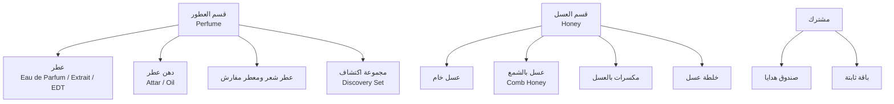

# المنتج والمجال (Product & Domain)

## 1. الرؤية في جملة

متجر صغير بمنتجات قليلة مختارة، يعرف كل برطمان من أي جبل جاء، وكل قارورة ماذا تحمل من نوتات، ويوصل الاثنين في علبة واحدة جميلة.

## 2. الأدوار

| الدور | ما يفعله |
|---|---|
| الزائر | يتصفح، يبحث، يستخدم دليل العطور، يضيف للسلة، يشتري كضيف |
| الزبون | كل ما سبق + حساب، عناوين، طلبات سابقة، إعادة طلب بنقرة، مفضلة، تقييم ما اشتراه |
| موظف المتجر | تجهيز الطلبات، الشحن، الرد على الزبائن، الإرجاع |
| مدير المحتوى | المنتجات، الصور، النصوص، القصص، القسائم |
| مدير المتجر | كل شيء + الأسعار + التقارير + الإعدادات |

## 3. قصص المستخدمين (V1)

### الزبون
- أدخل الموقع فأختار بسهولة: عطور أم عسل، أو أرى صندوق الهدايا الذي يجمعهما.
- **عطور:** أفلتر بالعائلة (شرقي، خشبي، زهري، منعش، عودي)، والجنس (رجالي، نسائي، للجنسين)، والتركيز، والموسم. أرى هرم النوتات بوضوح. أشتري عيّنة 2ml قبل القارورة الكاملة.
- **دليل العطور:** أجيب عن 4 أسئلة بسيطة (ماذا تحب؟ متى تتعطر؟ ما الذي لا تحبه؟) فيقترح عليّ 3 عطور.
- **عسل:** أفلتر بالنوع (زهور، كستناء، صنوبر، سدر، زعتر، أكاسيا)، والمنطقة، والوزن. أرى الطعم (حلاوة، مرارة، قوة) والقوام والتبلور. أرى تقرير التحليل للدفعة التي ستصلني.
- **مكسرات بالعسل وخلطات:** أرى المكونات بنسبها، ومسببات الحساسية بوضوح، وطرق التناول المقترحة، والتحذيرات.
- أمسح رمز QR على البرطمان فأرى صفحة دفعته.
- أبني صندوق هدايا: عطر + عسل + بطاقة برسالتي، وأشحنه لعنوان آخر دون إظهار السعر.
- أدفع بالبطاقة بالتقسيط، أو عند الاستلام، وأتابع شحنتي.
- أعيد طلب "عسلي المعتاد" بنقرة.

### المتجر
- أضيف منتجًا بخيارات (أحجام، أوزان) وأسعار ومخزون لكل خيار.
- أسجل دفعة جديدة: الكمية، تاريخ الإنتاج والانتهاء، المنطقة، رفع تقرير التحليل (PDF).
- أرى الطلبات الجديدة، أطبع قائمة التجهيز وبوليصة الشحن، وأغير الحالة.
- يصلني تنبيه حين ينخفض مخزون خيار عن حد معين، أو تقترب دفعة من الانتهاء.
- أنشئ قسيمة خصم محدودة (نسبة أو مبلغ، حد أدنى، قسم معين، عدد استخدامات، تاريخ).
- أعالج طلب إرجاع وفق السياسة، وأسترد المبلغ جزئيًا أو كليًا.

### خارج V1 (في roadmap.md)
الاشتراكات الشهرية، الولاء والنقاط، البيع بالجملة، البيع الدولي، التقييمات بالصور، البطاقات الهدية الرقمية.

## 4. نموذج الكتالوج

### 4.1 الأقسام وأنواع المنتجات

كل نوع منتج له **مجموعة خصائص محددة** (Attribute Set) يتحقق منها الخادم بمخطط (JSON Schema) لكل نوع. لا خصائص حرة.

### 4.2 الكيانات

**Product (المنتج)**
- `Id`, `Section` (Perfume | Honey | Shared), `Type`, `Slug`، `Status` (Draft | Active | Archived).
- ترجمات: الاسم، الوصف القصير، القصة، طريقة الاستخدام أو التناول، لكل لغة.
- `Attributes`: بحسب النوع (أدناه).
- `Warnings`: قائمة من رموز تحذيرات معرّفة مسبقًا (لا نص حر)، تُعرض آليًا: `honey.infant-under-12-months`، `allergen.tree-nuts`، `allergen.peanuts`، `allergen.sesame`، `perfume.flammable`، `perfume.external-use`، `perfume.allergens-listed`، `blend.consult-doctor-pregnancy`، `blend.diabetics`...
- `Allergens`: قائمة منظمة (مطلوبة للمكسرات والخلطات).
- `Media`: صور مرتبة بأدوار (catalog, detail, scale, packaging, mood)، فيديو اختياري.
- `SeoOverrides` لكل لغة.

**Variant (الخيار)**: ما يُشترى فعلًا.
- `Sku` (فريد)، `ProductId`، `Size` (للعطر: `Volume` بالمل، مثل 2، 10، 50، 100) أو `Weight` (للعسل: بالغرام، مثل 250، 500، 1000)، `Price: Money`، `CompareAtPrice` (السعر قبل الخصم، اختياري ومقيد قانونيًا: انظر compliance.md)، `Barcode` (GTIN)، `ShippingWeightGrams`، `ShippingClass` (Standard | Fragile | Liquid | Flammable)، `IsSample`.
- قاعدة: خيار العيّنة (2ml) لكل عطر له حد 3 لكل طلب.

**Batch (الدفعة)**: إلزامية لكل خيار في قسم العسل، واختيارية للعطور (رمز التصنيع).
- `Code` (رمز الدفعة المطبوع على الملصق)، `VariantId`، `Quantity`، `ProducedAt`، `BestBefore` (إلزامي للغذاء)، `Origin` (المنطقة، الارتفاع، النحّال إن رغب بالظهور)، `HarvestSeason`، `LabReportAssetId` (PDF)، `LabSummary` (قيم مختارة يسهل قراءتها: الرطوبة، HMF، نسبة حبوب اللقاح الغالبة...).
- قاعدة: لا تُباع دفعة تنتهي خلال أقل من 60 يومًا (القيمة قابلة للضبط)، والصرف FEFO.
- قاعدة: دفعة بلا تقرير تحليل لا تُعرض عليها شارة "مُحلَّل".

### 4.3 خصائص كل نوع

**عطر (Perfume)**
- `Concentration`: Extrait | EDP | EDT | EDC | Oil
- `Notes`: `{ top: [noteId], heart: [noteId], base: [noteId] }` من قاموس نوتات معرّف (`seed/taxonomy.json`) بترجماته وصوره الصغيرة.
- `Families`: حتى اثنتين (Oriental/Amber, Woody, Floral, Fresh/Citrus, Oud, Gourmand, Aromatic, Musky)
- `Gender`: Feminine | Masculine | Unisex
- `Seasons`، `Occasions`، `Intensity` (1 إلى 5)، `Longevity` (1 إلى 5)، `Sillage` (1 إلى 5)
- `InciIngredients`: قائمة المكونات بصيغة INCI (إلزامية قانونيًا على العبوة وتُعرض في الصفحة)، ومسببات الحساسية العطرية المُعلَنة.

**عسل خام (Honey)**
- `FloralSource`: Multifloral | Chestnut | Pine | Sidr | Thyme | Acacia | Citrus | Heather...
- `Region`، `Altitude` (اختياري)
- `TasteProfile`: `{ sweetness, bitterness, intensity }` من 1 إلى 5
- `Texture`: Liquid | Creamy | Crystallized، و `CrystallizationNote` (نص توعوي ثابت: التبلور طبيعي ولا يعني الغش).
- `ColorScale` (من فاتح إلى داكن)

**مكسرات بالعسل (NutsInHoney)**
- `HoneyType`، `Composition`: `[{ ingredient, percent }]` مجموعها 100، `Allergens` إلزامية.

**خلطة عسل (HoneyBlend)**
- `Composition`: `[{ ingredient, percent }]`، `SuggestedUse` (مقيّدة لغويًا، بلا ادعاء علاجي)، `Warnings` إلزامية.
- **ملاحظة:** الاسم الداخلي والخارجي "خلطة عسل" أو "عسل بالحبة السوداء والزنجبيل"، لا "خلطة طبية". (انظر compliance.md)

**صندوق هدايا (GiftBox)**: قالب له "خانات": مثلًا خانة عطر (من قائمة مسموحة) + خانة عسل + بطاقة. سعر الصندوق = مجموع المحتوى + سعر العلبة، أو سعر ثابت بخصم. المخزون يُحسب من المكونات.

**باقة ثابتة (Bundle)**: منتجات محددة مسبقًا بسعر واحد، والمخزون من المكونات.

### 4.4 كيانات التجارة (تفصيلها في commerce-flows.md)
`Customer`، `Address`، `Cart` و `CartLine`، `StockReservation`، `Order` و `OrderLine` (لقطة مجمدة)، `Payment`، `Shipment`، `ReturnRequest`، `Refund`، `Coupon`، `Invoice`.

### 4.5 الأحداث
`ProductPublished`، `PriceChanged`، `BatchReceived`، `BatchNearExpiry`، `StockLow`، `CheckoutStarted`، `PaymentSucceeded`، `PaymentFailed`، `OrderPlaced`، `OrderShipped`، `OrderDelivered`، `ReturnRequested`، `RefundIssued`.

تُكتب عبر Outbox وتعالج في الخلفية: البريد والرسائل، تحديث البحث، إبطال الكاش، تنبيهات المخزون، الفاتورة الإلكترونية.

## 5. مقاييس النجاح
- معدل التحويل لكل قسم، ومعدل التخلي عن السلة في كل خطوة دفع.
- نسبة الطلبات التي تجمع القسمين (مقياس نجاح فكرة العلامة الواحدة).
- معدل إعادة الشراء خلال 60 يومًا (العسل منتج يتكرر).
- تحويل العيّنة إلى قارورة كاملة.
- نسبة الإرجاع والشحنات التالفة (هدف: أقل من 1%).
